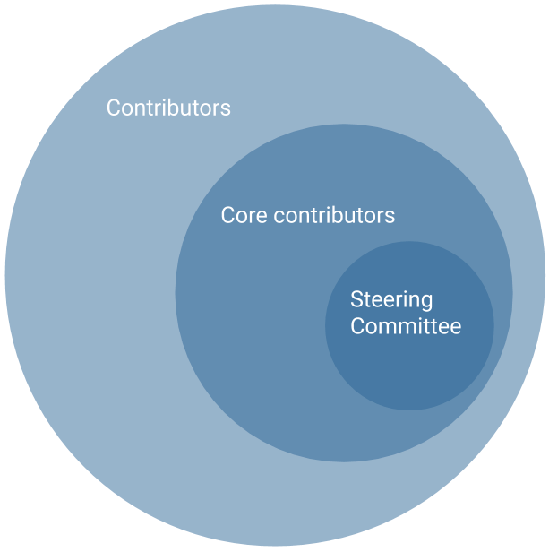

## OpenML governance and decision-making

The purpose of this document is to formalize the governance process used by the OpenML project (the OpenML GitHub organization which contains all code and projects related to OpenML.org), to clarify how decisions are made and how the various elements of our community interact. This document establishes a decision-making structure that takes into account feedback from all members of the community and strives to find consensus, while avoiding any deadlocks.

This is a meritocratic, consensus-based community project. Anyone with an interest in the project can join the community, contribute to the project design, and participate in the decision making process. This document describes how that participation takes place and how to set about earning merit within the project community.

### Roles And Responsibilities

#### Contributors

Contributors are community members who contribute in concrete ways to the project. Anyone can become a contributor, and contributions can take many forms – not only code – as detailed in the contributors guide. Contributors need to create pull requests to contribute to the code or documentation.

#### Core contributors

Core contributors are community members who have shown that they are dedicated to the continued development of the project through ongoing engagement with the community. They have shown they can be trusted to maintain OpenML with care. Being a core contributor allows contributors to more easily carry on with their project related activities by giving them write access to the project’s repository (abiding by decision making process, e.g. voting on pull requests) and is represented as being an organization member on the OpenML GitHub organization. Core contributors are expected to review code contributions, can merge approved pull requests, can cast votes for and against merging a pull-request, and can be involved in deciding major changes to the API.

New core contributors can be nominated by any existing core contributors. Once they have been nominated, there will be a vote in the [private OpenML core email list](https://lists.lrz.de/mailman/listinfo/openml-core) by the current core contributors. While it is expected that most votes will be unanimous, a two-thirds majority of the cast votes is enough. The vote needs to be open for at least 1 week.

Core contributors that have not contributed to the project (commits or GitHub comments) in the past 12 months will become emeritus core contributors and recant their commit and voting rights until they become active again. The list of core contributors, active and emeritus (with dates at which they became active) is public on the OpenML website.

#### Steering Committee

The Steering Committee (SC) members are core contributors who have additional responsibilities to ensure the smooth running of the project. SC members are expected to participate in strategic planning, join monthly meetings, and approve changes to the governance model. The purpose of the SC is to ensure a smooth progress from the big-picture perspective. Indeed, changes that impact the full project require a synthetic analysis and a consensus that is both explicit and informed. In cases that the core contributor community (which includes the SC members) fails to reach such a consensus in the required time frame, the SC is the entity to resolve the issue. 

The Steering Committee consists of community representatives and partner representatives.

Community representatives of the SC are nominated by a core contributor. A nomination will result in a discussion that cannot take more than a month and then a vote by the core contributors which will stay open for a week. Partner institutions who enter a collaboration agreement with the OpenML Foundation can nominate a representative on the Steering Committee, if so agreed in the collaboration agreement.

SC membership votes are subject to a two-third majority of all cast votes as well as a simple majority approval of all the current SC members. When decisions are escalated to the steering committee (see the decision making process below), and no consensus can be found within a month, the SC can decide with a simple majority vote. In addition, to ensure the community character of the OpenML project, community representatives always carry at least 51% of the vote.

SC members who do not actively engage with the SC duties are expected to resign.

The initial Steering Committee of OpenML consists of Bernd Bischl, Giuseppe Casalicchio, Matthias Feurer, Heidi Seibold, Jan van Rijn, and Joaquin Vanschoren.

### Decision Making Process

Decisions about the future of the project are made through discussion with all members of the community. All non-sensitive project management discussion takes place on the project contributors’ mailing list and the issue trackers of the sub-projects. Occasionally, sensitive discussion occurs on a private list. This includes voting on core/SC membership or discussion of internal disputes. All discussions must follow the [OpenML honor code](https://docs.openml.org/terms/).

OpenML uses a “consensus seeking” process for making decisions. The group tries to find a resolution that has no open objections among core contributors. At any point during the discussion, any core contributors can call for a vote, which will conclude one month from the call for the vote. 

If no option can gather two thirds of the votes cast, the decision is escalated to the SC, which in turn will use consensus seeking with the fallback option of a simple majority vote if no consensus can be found within a month. This is what we hereafter may refer to as “the decision making process”. It applies to all core OpenML repositories.

Decisions (in addition to adding core contributors and SC membership as above) are made according to the following rules:

*   Minor Documentation changes, such as typo fixes, or addition / correction of a sentence: requires +1 by a core contributor, no -1 by a core contributor (lazy consensus), happens on the issue or pull request page. Core contributors are expected to give “reasonable time” to others to give their opinion on the pull request if they’re not confident others would agree.
*   Code changes and major documentation changes require +1 by two core contributors, no -1 by a core contributor (lazy consensus), happens on the issue or pull-request page.
*   Major changes to the API principles and metadata schema require a concrete proposal outlined in an OpenML Request for Comments (RfC), which has to be opened for public consultation for at least 1 month. The final version has to be approved using the decision-making process outlined above (two-third of the core contributor vote or simple majority if escalated to the SC).
*   Changes to the governance model use the same decision process outlined above.

If a veto -1 vote is cast on a lazy consensus, the proposer can appeal to the community and core contributors and the change can be approved or rejected using the decision making procedure outlined above.

### Communication channels

OpenML uses the following communication channels:

*   An open contributor mailing list and the GitHub issue trackers.
*   A chat application for daily interaction with the community (currently Slack).
*   Private email lists for the core developers and steering committee, for membership voting and sensitive discussions.
*   A monthly Steering Committee meeting at predefined times, listed on the website. They are usually open to all steering committee members and core contributors, and they can all request discussion on a topic via the private mailing list. Closed meetings for SC members only can be called in if there are sensitive discussions or other valid reasons.
*   A monthly Engineering meeting at predefined times, listed on the website. The meeting is open to all. Discussion points are put on the [project roadmap](https://github.com/orgs/openml/projects/2).
