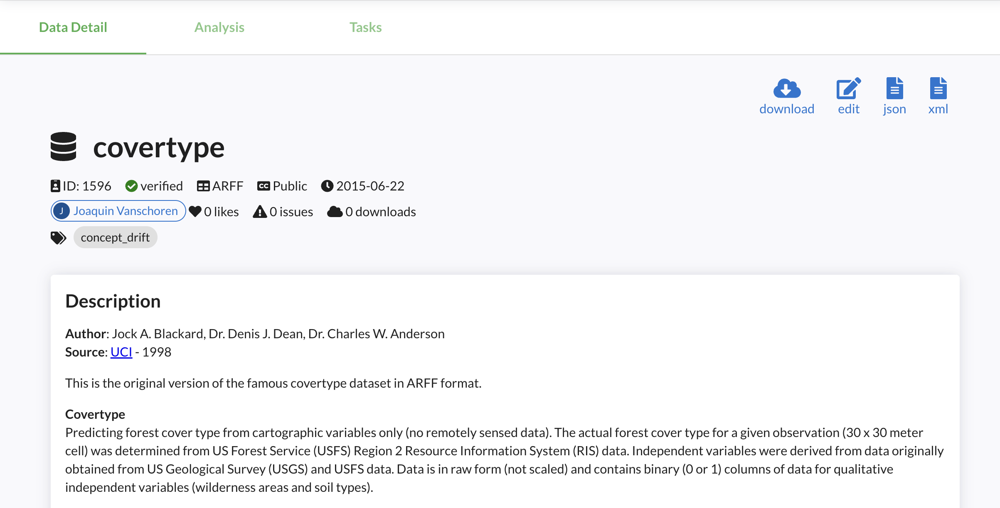
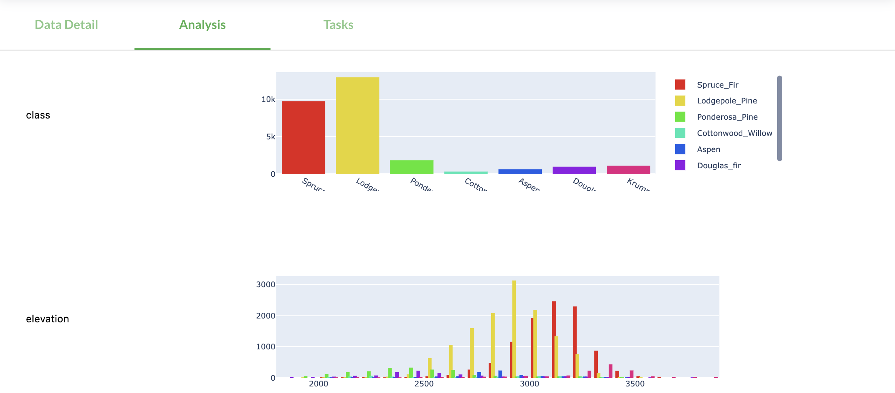

# Data
## Discovery
OpenML allows fine-grained search over thousands of machine learning datasets. Via the <a href="https://www.openml.org">website</a>, you can filter by many dataset properties, such as size, type, format, and many more. Via the [APIs](https://www.openml.org/apis) you have access to many more filters, and you can download a complete table with statistics of all datasest. Via the APIs you can also load datasets directly into your preferred data structures such as numpy ([example in Python](https://openml.github.io/openml-python/main/examples/20_basic/simple_datasets_tutorial.html#sphx-glr-examples-20-basic-simple-datasets-tutorial-py)). We are also working on better organization of all datasets by topic <i class="fa fa-heart fa-fw fa-lg" style="color:red"></i>

<!--  -->


## Sharing
You can upload and download datasets through the <a href="https://www.openml.org/auth/upload-dataset" target="_blank">website</a> or though the [APIs](https://www.openml.org/apis) (recommended). You can share data directly from common data science libraries, e.g. from <a href="https://openml.github.io/openml-python/main/examples/30_extended/create_upload_tutorial.html#sphx-glr-examples-30-extended-create-upload-tutorial-py" target="_blank">Python</a> or <a href="https://openml.github.io/openml-r/articles/OpenML.html#upload-a-data-set-1" target="_blank">R</a> dataframes, in a few lines of code. The OpenML APIs will automatically extract lots of meta-data and store all datasets in a uniform format.</p>

``` python
    import pandas as pd
    import openml as oml

    # Create an OpenML dataset from a pandas dataframe
    df = pd.DataFrame(data, columns=attribute_names)
    my_data = oml.datasets.functions.create_dataset(
        name="covertype", description="Predicting forest cover ...",
        licence="CC0", data=df
    )

    # Share the dataset on OpenML
    my_data.publish()
```

Every dataset gets a dedicated page on OpenML with all known information, and can be edited further online.

<!--  -->


Data hosted elsewhere can be referenced by URL. We are also working on interconnecting OpenML with other machine learning data set repositories <i class="fa fa-heart fa-fw fa-lg" style="color:red"></i>

## Automated analysis
OpenML will automatically analyze the data and compute a range of <a href="https://www.openml.org/search?q=+measure_type%3Adata_quality&type=measure" target="_blank">data quality characteristics</a>. These include simple statistics such as the number of examples and features, but also potential quality issues (e.g. missing values) and more advanced statistics (e.g. the mutual information in the features and benchmark performances of simple models). These can be useful to find, filter and compare datasets, or to automate data preprocessing.  We are also working on simple metrics and automated dataset quality reports <i class="fa fa-heart fa-fw fa-lg" style="color:red"></i>

The Analysis tab (see image below, or <a href="https://www.openml.org/search?type=data&status=active&id=180" target="_blank">try it live</a>) also shows an automated and interactive analysis of all datasets. This runs on open-source Python code via <a href="https://plotly.com/dash/" target="_blank">Dash</a> and we <a href="https://github.com/openml/openml.org" target="_blank">welcome all contributions</a> <i class="fa fa-heart fa-fw fa-lg" style="color:red"></i>

<!--  -->


The third tab, 'Tasks', lists all tasks created on the dataset. More on that below.

## Dataset ID and versions
A dataset can be uniquely identified by its dataset ID, which is shown on the website and returned by the API. It's `1596` in the `covertype` example above. They can also be referenced by name and ID. OpenML assigns incremental version numbers per upload with the same name. You can also add a free-form `version_label` with every upload.

## Dataset status
When you upload a dataset, it will be marked `in_preparation` until it is (automatically) verified. Once approved, the dataset will become `active` (or `verified`). If a severe issue has been found with a dataset, it can become `deactivated` (or `deprecated`) signaling that it should not be used. By default, dataset search only returns verified datasets, but you can access and download datasets with any status.

## Special attributes
Machine learning datasets often have special attributes that require special handling in order to build useful models. OpenML marks these as special attributes.

A `target` attribute is the column that is to be predicted, also known as dependent variable. Datasets can have a <i>default target attribute</i> set by the author, but OpenML tasks can also overrule this. Example: The default target variable for the <a href="https://www.openml.org/d/554" target="_blank">MNIST</a> dataset is to predict the class from pixel values, and most supervised tasks will have the class as their target. However, one can also create a task aimed at predicting the value of pixel257 given all the other pixel values and the class column.

`Row id` attributes indicate externally defined row IDs (e.g. `instance` in <a href="https://www.openml.org/d/164">dataset 164</a>). `Ignore` attributes are other columns that should not be included in training data (e.g. `Player` in <a href="https://www.openml.org/d/185">dataset 185</a>). OpenML will clearly mark these, and will (by default) drop these columns when constructing training sets.