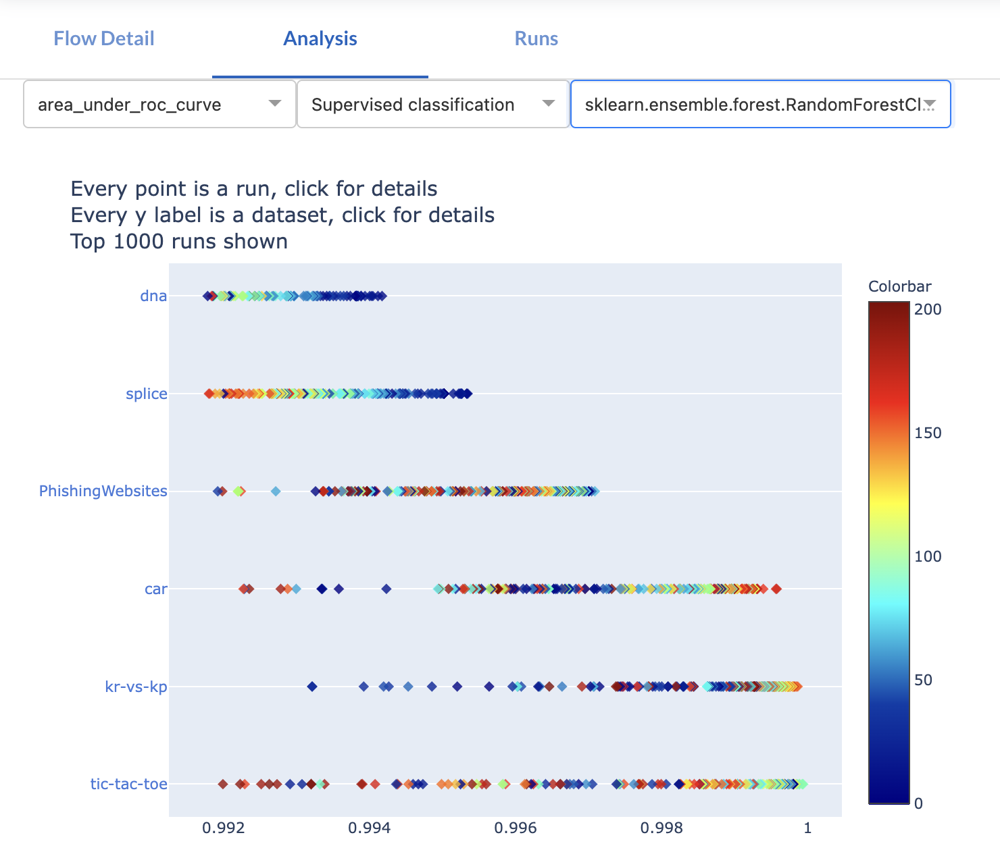

# Runs

Runs are the results of experiments evaluating a flow with a specific configuration on a specific task. 
They contain at least a description of the hyperparameter configuration of the Flow and the predictons produced for the machine learning Task.
Users may also provide additional metadata related to the experiment, such as the time it took to train or evaluate the model, or their predictive performance.
The OpenML server will also compute several common metrics on the provided predictions as appropriate for the task, such as accuracy for a classification task or root mean squared error for regression tasks.

For example, [this run](https://www.openml.org/search?type=run&id=10452858&run_flow.flow_id=17691&sort=date) describes an experiment that:

 - evaluates a Random Forest pipeline ([flow 17650](https://www.openml.org/f/17650) linked to the task)
 - with the configuration `min_samples_leaf=1, n_estimators=500, ...` ([setup 8261828](https://www.openml.org/api/v1/json/setup/8261928) linked to the task)
 - in a 10-fold CV experiment ([task 3481](https://www.openml.org/t/3481) linked to the run)
 - on dataset "isolet" ([dataset 300](https://www.openml.org/d/300) as described by the task)
 - produced predictions in arff format ([predictions.arff](https://www.openml.org/data/download/21829039/predictions.arff))
 - several metadata (e.g., metric evaluations) as seen on the run page

## Automated reproducible evaluations
While the REST API and the OpenML connectors allow you to manually submit Run data, openml-python and mlr3oml also support automated running of experiments and data collection.
The openml-python example below will evaluate the `RandomForestClassifier` on a given task and automatically track information such as the duration of the experiment, the hyperparameter configuration of the model, and version information about the software used in the experiment, and bundle it for convenient upload to OpenML.

``` python
    from sklearn import ensemble
    from openml import tasks, runs

    # Build any model you like.
    clf = ensemble.RandomForestClassifier()

    # Evaluate the model on a task
    run = runs.run_model_on_task(clf, task)

    # Share the results, including the flow and all its details.
    run.publish()
```

The standardized way of accessing datasets and tasks makes it easy to run large scale experiments in this manner.

!!! note
    While OpenML tries to facilitate reproducibility, exactly reproducing all results is not generally possible because of changes in numeric libraries, operating systems, hardware, and even random factors (such as hardware errors).

## Online organization

All runs are available from the OpenML platform, through either direct access with the REST API or through visualizations in the website.
The scatterplot below shows many runs for a single Flow, each dot represents a Run.
For each run, all metadata is available online, as well as the produced predictions and any other provided artefacts.
You can download OpenML runs and analyse the results any way you like.

<!--  -->

