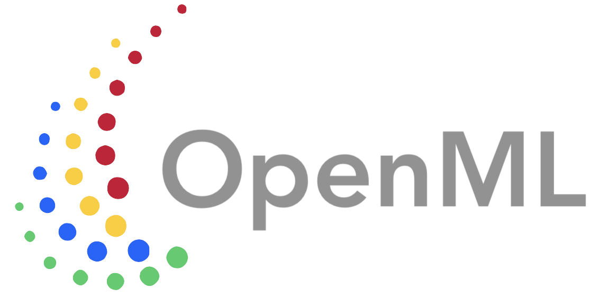

# Style guide

These are some (non-mandatory) style guidelines to make the OpenML experience more pleasant and consistent for everyone.

## Logos
</img> 
</img> 
</img> 
(SVG)</img> 

## Colors

We use the [Material Design](https://m2.material.io/design/color/the-color-system.html#color-usage-and-palettes) color system,
and especially the colors green[400], yellow[800], blue[800], red[400], green[400], yellow[800], pink[400], and purple[400].

Primary colors are #1E88E5 (general), #000482 (dark), and #b5b7ff (light).

