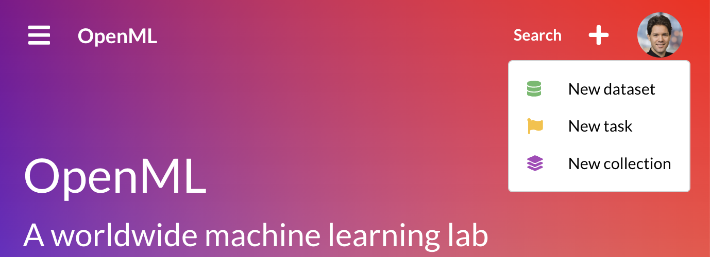
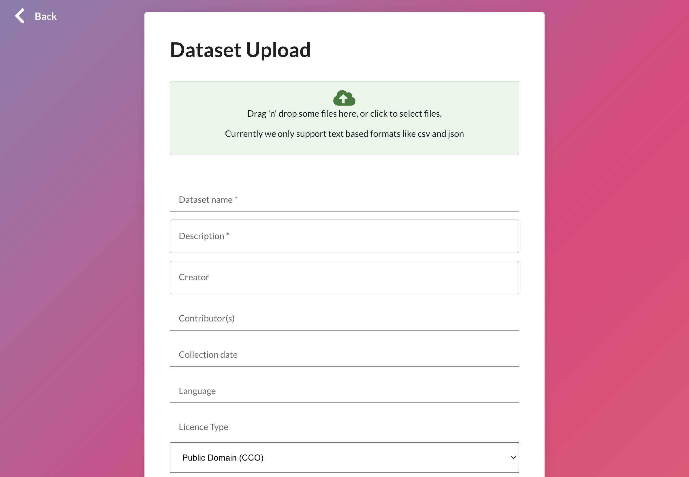
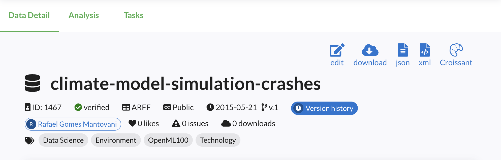

<link rel="stylesheet" href="https://cdnjs.cloudflare.com/ajax/libs/font-awesome/6.2.1/css/all.min.css">

# Creating and sharing datasets

{ width="100%" style="max-height: 30vh; max-width: 700px;" }

It’s easy to share machine learning datasets through OpenML, and doing so is a great way to make your dataset widely available to the machine learning community:

<i class="fa fa-bolt fa-fw fa-lg" style="color: #FF8A80;"></i> &nbsp; Allow anyone to easily import your dataset into AI libraries, perform benchmarks, and share models.

<i class="fa fa-share-nodes fa-fw fa-lg" style="color: #80E27E;"></i> &nbsp; Make your dataset Findable, Accessible, Interoperable and Reusable through <a href="https://www.go-fair.org/fair-principles/">FAIR</a> and <a href="https://mlcommons.org/working-groups/data/croissant/#:~:text=Croissant%20is%20an%20open%20community,these%20datasets%20in%20ML%20tools.">Croissant</a> standards.

<i class="fa fa-images fa-fw fa-lg" style="color: #82B1FF;"></i> &nbsp; Easily explore your dataset through dashboards and automated analyses.

You can share your data [via code](#frictionless-data-sharing) (recommended!) or via a [web UI](#web-ui).


## Frictionless data sharing
We believe that data sharing should be as frictionless and automated as possible. That's why **OpenML has created libraries that automate both the uploading and downloading of datasets for you**. If you can load a dataset in common data structures (e.g. a pandas dataframe), you can upload it to OpenML in a few lines of code, and OpenML will automatically store it in [efficient data formats](https://blog.openml.org/openml/data/2020/03/23/Finding-a-standard-dataset-format-for-machine-learning.html). Vice versa, you can download any OpenML dataset directly into common machine learning libraries. Hence, you never have to worry about data formatting or maintaining data loaders.


### Getting started
We offer APIs in different languages to help you upload datasets. Here are some basic examples:

=== "Python"

    ``` python
    import pandas as pd
    import openml as oml

    # Load your data (eg. a pandas dataframe)
    df = pd.DataFrame(data, columns=attribute_names)

    # Add basic info
    my_data = oml.datasets.functions.create_dataset(
        data=df, name="mydataset", licence="CC0", 
        description="A dataset from me for you...")

    # Set your API key (can also be in a config file)
    openml.config.apikey = 'YOURKEY'

    # Share the dataset on OpenML
    my_data.publish()
    ```

=== "R"
    ``` r
    library(mlr3oml)

    # Create any R dataframe 
    df <- read.csv("your_file.csv")

    # Share the dataset on OpenML
    publish_data(
        df,  # Any data.frame()
        name,
        description,
        license = NULL,
        default_target = NULL,
        citation = NULL,
        row_identifier = NULL,
        ignore_attribute = NULL,
        original_data_url = NULL,
        paper_url = NULL,
        test_server = test_server_default(),
        api_key = NULL
    )
    ```

=== "Java"
    ``` java
    import org.openml.apiconnector.io.ApiConnector;
    import org.openml.apiconnector.xml.UploadDataset;

    public class OpenMLDatasetUpload {
        public static void main(String[] args) {
            try {
                // Initialize API connection with your API key
                String apiKey = "your_openml_api_key";  // Replace with your API key
                ApiConnector openml = new ApiConnector(apiKey);

                // Path to the dataset file (e.g. a CSV)
                String filePath = "path/to/your/dataset.csv";

                // Metadata for the dataset
                String name = "MyDataset";
                String description = "This is a test dataset uploaded via Java API";
                String format = "csv";

                // Upload dataset
                UploadDataset response = openml.dataUpload(filePath, name, description, format);

                // Print uploaded dataset ID
                System.out.println("Dataset uploaded successfully with ID: " + response.getId());

            } catch (Exception e) {
                e.printStackTrace();
            }
        }
    }
    ```

??? languages "More languages"
    Would you like to add support for your favourite language? Get it touch. We're happy to help you get started!


### Complete Python examples
Our libraries support commonly used rich data structures. First load your data in your preferred way, add information as needed, then publish. 
For Python, here are some basic examples. For more examples, [see the python API docs](../examples/30_extended/create_upload_tutorial/).

=== "Pandas"

    ``` python
    import pandas as pd
    import openml

    # Load your data (eg. a pandas dataframe)
    df = pd.DataFrame(data, columns=attribute_names)

    # Extra information, e.g. descriptions and citations
    # This can also be updated later.
    description = (
    "The weather problem is a tiny dataset that we will use repeatedly"
    "to illustrate machine learning methods. In this case there are four "
    "attributes: outlook, temperature, humidity, and windy. "
    "The outcome is whether to play or not."
    )
    citation = (
        "I. H. Witten, E. Frank, M. A. Hall"
        "Data mining practical machine learning tools and techniques, "
        "Third edition. Morgan Kaufmann Publishers, 2011"
    )

    # Create the dataset
    my_dataset = openml.datasets.create_dataset(
        data=df,                         # The data
        name="Weather",                  # Dataset name
        description=description,         # Description (can be long)
        creator="I. H. Witten, E. Frank, M. A. Hall",
        contributor=None,                # Creators and contributors
        collection_date="01-01-2011",    # When was data gathered
        language="English",              # Data language
        licence="CC0",                   # Any CC licence
        default_target_attribute="play", # Feature with the correct labels
        row_id_attribute=None,           # Row ID column (will be dropped before training)
        ignore_attribute=None,           # Other columns to be dropped before training
        citation=citation,               # Paper citations
        attributes="auto",               # Automatically infer column types
        version_label="1.0",             # Optional version label (for your own reference)
        original_data_url=None,          # Link to original location/host of the dataset
        paper_url=None,                  # Link to a paper describing the dataset
    )

    # Set your API key (can also be in a config file)
    openml.config.apikey = 'YOURKEY'

    # Share the dataset on OpenML
    my_dataset.publish()

    # New webpage created for this dataset
    print(f"Dataset now availabel at: {my_dataset.openml_url}")
    ```

=== "Numpy"

    ``` python
    import numpy as np
    import openml as oml

    # Your numpy data
    X, y = data, target

    # Merge and add column information
    data = np.concatenate((X, y.reshape((-1, 1))), axis=1)
    attributes = [(attribute_name, "REAL") for attribute_name in attribute_names] + [
        ("class", "INTEGER")
    ]

    # Extra information, e.g. descriptions and citations
    # This can also be updated later.
    description = (
    "The weather problem is a tiny dataset that we will use repeatedly"
    "to illustrate machine learning methods. In this case there are four "
    "attributes: outlook, temperature, humidity, and windy. "
    "The outcome is whether to play or not."
    )
    citation = (
        "I. H. Witten, E. Frank, M. A. Hall"
        "Data mining practical machine learning tools and techniques, "
        "Third edition. Morgan Kaufmann Publishers, 2011"
    )

    # Create the dataset
    my_dataset = create_dataset(
        data=df,                         # The data
        name="Weather",                  # Dataset name
        description=description,         # Description (can be long)
        creator="I. H. Witten, E. Frank, M. A. Hall",
        contributor=None,                # Creators and contributors
        collection_date="01-01-2011",    # When was data gathered
        language="English",              # Data language
        licence="CC0",                   # Any CC licence
        default_target_attribute="play", # Feature with the correct labels
        row_id_attribute=None,           # Row ID column (will be dropped before training)
        ignore_attribute=None,           # Other columns to be dropped before training
        citation=citation,               # Paper citations
        attributes=attributes,           # Attributes and type ('auto' doesn't work for numpy)
        version_label="1.0",             # Optional version label (for your own reference)
        original_data_url=None,          # Link to original location/host of the dataset
        paper_url=None,                  # Link to a paper describing the dataset
    )

    # Set your API key (can also be in a config file)
    openml.config.apikey = 'YOURKEY'

    # Share the dataset on OpenML
    my_dataset.publish()

    # Webpage created for this dataset
    print(f"Dataset now availabel at: {my_dataset.openml_url}")
    ```

=== "Sparse data"

    ``` python
    import numpy as np
    import openml as oml

    # Your sparse data
    sparse_data = coo_matrix(
        ([0.0, 1.0, 1.0, 1.0, 1.0, 1.0, 1.0], ([0, 1, 1, 2, 2, 3, 3], [0, 1, 2, 0, 2, 0, 1]))
    )

    # Column names and types
    column_names = [
        ("input1", "REAL"),
        ("input2", "REAL"),
        ("y", "REAL"),
    ]

    # Create the dataset
    my_dataset = create_dataset(
        data=df,                         # The data
        name="Weather",                  # Dataset name
        description=description,         # Description (can be long)
        creator="I. H. Witten, E. Frank, M. A. Hall",
        contributor=None,                # Creators and contributors
        collection_date="01-01-2011",    # When was data gathered
        language="English",              # Data language
        licence="CC0",                   # Any CC licence
        default_target_attribute="play", # Feature with the correct labels
        row_id_attribute=None,           # Row ID column (will be dropped before training)
        ignore_attribute=None,           # Other columns to be dropped before training
        citation=citation,               # Paper citations
        attributes=column_names,         # Attributes and type ('auto' doesn't work for numpy)
        version_label="1.0",             # Optional version label (for your own reference)
        original_data_url=None,          # Link to original location/host of the dataset
        paper_url=None,                  # Link to a paper describing the dataset
    )

    # Set your API key (can also be in a config file)
    openml.config.apikey = 'YOURKEY'

    # Share the dataset on OpenML
    my_dataset.publish()

    # Webpage created for this dataset
    print(f"Dataset now availabel at: {my_dataset.openml_url}")
    ```

??? languages "More data structures"
    Would you like to add support for your favourite data structures? Get it touch. We're happy to help you get started!

??? languages "You control the data formatting"
    Data is often stored in inefficient ways, over many files, sometimes in obscure data formats, and sometimes you need domain knowledge to load it correcty.
    That's why we encourage you do load the data in the correct modern way, using the appropriate data structures, and share it as such.
    Our libraries can then transfer and store it efficiently (e.g. in Parquet), and easily load it later on. This also means that data loaders don't break as technologies evolve.

### Large multi-modal data
In the examples above, you can share any data supported by the data structure. These can easily hold complex numeric data, strings, text, and links to images or files. For large and/or multi-modal datasets with many local files, we recommend the following approach:

* Create a dataframe with all the dataset information, and columns with paths to local files
* Create a folder with all the local files (e.g. images, video, audio) according to the paths in main dataframe
* Upload the main dataframe using the method above
* Upload the folder with all the local files using an appropriate data transfer tool. [Contact us](mailto:openmlhq@gmail.com), we're happy to help with this.

!!! languages "More automation coming"
    We're working on an automated procedure for the last step in our next API release. Watch this space :). For now, we'll gladly assist you with the manual step.

### Editing datasets
You can edit OpenML datasets in various ways.

First, you can create a new version of a dataset by creating another dataset with the exact same name. OpenML will automatically create a new version of that dataset.

You can also edit the metadata of existing dataset. You can only edit non-critical meta-data fields, such as the dataset description, creator, contributor, collection_date, language, citation, original_data_url, and paper_url. Previous versions of the metadata are stored and versioned. The best way do this is via the [Python Dataset Edit API](https://openml.github.io/openml-python/main/generated/openml.datasets.edit_dataset.html#openml.datasets.edit_dataset). You can also edit the metadata via the website by going to the webpage of that dataset and clicking the 'edit' button. This is most convenient for editing the dataset description in markdown, including previews.

=== "Python"

    ``` python
    data_id = edit_dataset(
        128, # dataset ID 
        description="A more complete dataset description",
        creator="J.Appleseed",
        collection_date="2017",
        citation="On dataset creation. DMLR, 2017",
        language="English",
    )
    ```

??? languages "Protected fields"
    Certain fields are protected (default_target_attribute, row_id_attribute, ignore_attribute) since changing them will affect models trained on the dataset. Changing these fields is allowed only for the dataset owner, and only if the dataset does not yet have any tasks associated with it.


### Forking datasets
You can 'fork' an existing datasets, which creates a copy of the dataset with you as the owner. This can be useful, for instance, to correct critical mistakes or adopt orphaned datasets. Use this API only if you are unable to edit the original dataset. After the dataset is forked, you can edit the new version of the dataset as you like. 

=== "Python"

    ``` python

    # Forks dataset with ID=1 and returns the forked dataset ID
    data_id = fork_dataset(1)

    # You can now edit the dataset
    data_id = edit_dataset(data_id, default_target_attribute="shape")
    ```

## Web UI
Although we warmly recommend creating your data [via code](#frictionless-data-sharing), we also offer a <a href="https://www.openml.org/auth/upload-dataset" target="_blank">Web UI</a>. 

### Creating datasets
Creating datasets works as follows:

* Sign into the OpenML website. Sign up if you do not have an account yet.
* Click the 'plus' icon on the top right, and then 'New dataset'

{ width="100%" style="max-width: 700px;" }

* Drag-and-drop a dataset file or click the cloud icon to open a file browser.
* Supported file formats are csv, excel, sql, json, parquet.

{ width="100%" style="max-width: 700px;" }

* Fill in the remaining information. The dataset name, description, and licence are required.
* Click 'Upload dataset'. This will start the upload and redirect you to the new dataset page when done.

??? languages "Limitations"
    Web UIs have natural limitations. We use pandas in the background and therefore only support any file format that pandas supports (csv, excel, sql, json, parquet). We also recommend not uploading datasets larger than 2GB via the web UI. If any of this is a problem, please upload your data [via code](#frictionless-data-sharing) or [contact us](mailto:openmlhq@gmail.com)!

### Editing datasets
Editing datasets works as follows:

* Sign into the OpenML website. Sign up if you do not have an account yet.
* Navigate to the dataset of interest and click the 'edit' icon on the top right

{ width="100%" style="max-width: 700px;" }

* Edit any field of the meta-data. Markdown and preview are supported for the dataset description.

{ width="100%" style="max-width: 700px;" }

* Click 'Edit dataset'. This will store the new metadata description. Each edit is stored and versioned.
